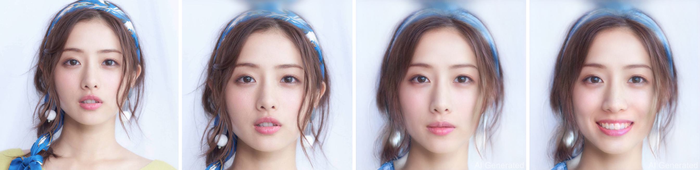
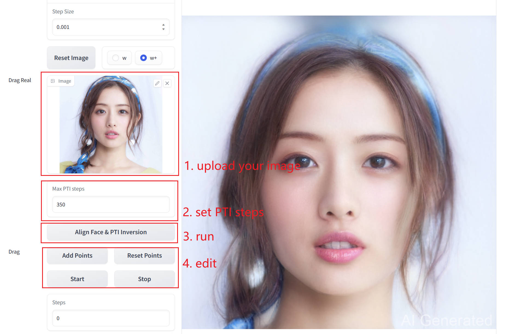

<p align="center">

<h1 align="center">DragGAN for Editting Real Image</h1>

<div align="center">
  
</div>

**This GUI supports editing real images**. Since DragGAN manipulates images in latent space by point-based manipulation, editing real image requires:
1. Convert real image to latent code by GAN inversion, like [PTI](https://github.com/danielroich/PTI) mentioned by the DragGAN project.
2. Load the latent code and converted model weights(pt->pkl) to the DragGAN GUI.


## Requirements

```
conda env create -f environment.yml
conda activate stylegan3
```

## Download pre-trained weights

* To download pre-trained stylegan2 weights, run:
```
python scripts/download_model.py
```
* To dowmload align.dat and ffhq.pkl in PTI project
  * [FFHQ StyleGAN](https://nvlabs-fi-cdn.nvidia.com/stylegan2-ada-pytorch/pretrained/ffhq.pkl)
  * [Dlib alignment](https://drive.google.com/file/d/1HKmjg6iXsWr4aFPuU0gBXPGR83wqMzq7/view?usp=sharing) 


## Run DragGAN-Real GUI
You can run DragGAN-Real Gradio demo as well, this is universal for both windows and linux:

```sh
python visualizer_drag_gradio.py
```
## Usage
<div align="center">
  
</div>
After click the `Align Face & PTI inversion` button, wait for a few minutes. When the image generated on the right, you can edit like DragGAN.

## Limitations
1. Distortion still present, it's difficult to avoid with GAN inversion.
2. Inversion takes a long time, faces will be aligned in PTI, so font faces may be more suitable.

## Acknowledgement

This code is based on [DragGAN](https://github.com/XingangPan/DragGAN). Part of the PTI is based on [PTI](https://github.com/danielroich/PTI). And the model convert is from this [issue](https://github.com/danielroich/PTI/issues/26) in PTI.

